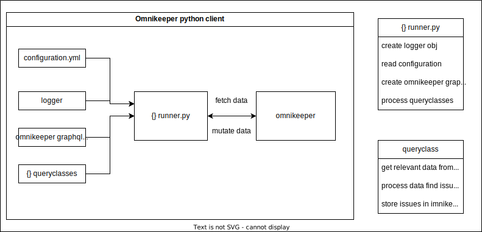

## Introduction

Omnikeeper python client offers a way to develop easiliy python applications that follow the
queryclass concept.

In the following picture the runner workflow has been shown. The runner can be imported in specific projects and it will process all queryclasses defined. 

The responsibilities of the runner.py are:

- The runner will read the configuration file from **config/**.
- Logger object will be created.
- graphql client for communicating with omnikeeper will be created.
- Each queryclass defined in the queryclasses module will be processed.